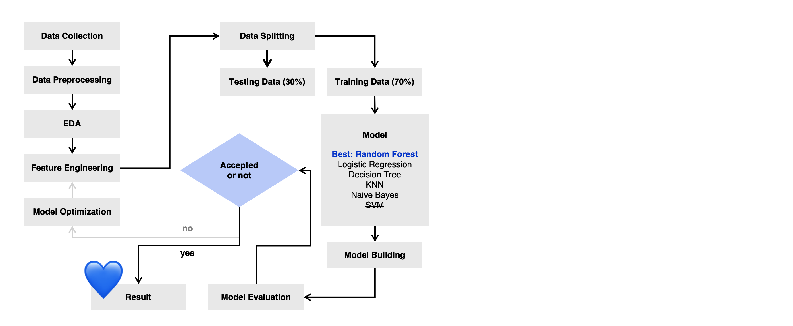
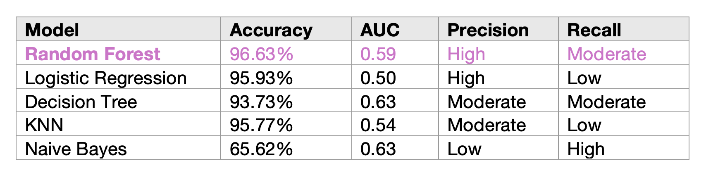

# OptiDeliver: Machine Learning for Enhanced Delivery Predictions🚛📦🌧️ 
This project leverages machine learning to enhance delivery time predictions within Brazil's rapidly growing e-commerce sector, aiming to improve customer satisfaction by providing more accurate delivery estimates. Utilizing a comprehensive dataset from Olist, Brazil's largest online marketplace, this study integrates various data types including customer details, order specifics, product information, and geolocation, enhanced with external weather and distance data.

## Visualization & Insight in Tableau💐
To provide insights into delivery times and their influencing factors (such as weather, holidays, and distance) in Brazil's e-commerce.

Tableau Public Dashboard: https://public.tableau.com/app/profile/libing.gu/viz/OptiDeliverE-commerceDeliveryTimeAnalysis/E-commerceDeliveryTimeAnalysisandPrediction?publish=yes

## Workflow🌪️

## Objective🎯
The goal of this project is to develop a predictive model that uses historical order data along with external factors such as weather conditions and public holidays to address the issue of unpredictable delivery times, thereby enhancing customer satisfaction and operational efficiency.

## Models Evaluated⚖️

- **Random Forest** : The most effective model, achieving an accuracy of **96.63%** and an AUC of **0.59**.
- Logistic Regression
- Decision Tree
- K-Nearest Neighbors (KNN)
- Naive Bayes
- SVM: be dropped

## Repository Contents
- `notebooks/`: Jupyter notebooks with the complete analysis and model training processes.
- `src/`: Source code for the machine learning models and data preprocessing.
- `results/`: Output results and model performance metrics.
- `data/`: Directory containing the dataset used in the analyses.
- `requirements.txt`: Required libraries and dependencies to run the project.

## Acknowledgments🙏
Appreciation to Silvia Xie, Evelyn Li and Mint Kansinee who have invested their time in improving this project.

## Data Sources 
- Brazilian E-Commerce Public Dataset by Olist: https://www.kaggle.com/datasets/olistbr/brazilian-ecommerce/versions/7
- Brazil Holidays - CalendarLabs: https://www.calendarlabs.com/holidays/brazil/2018#google_vignette
- Weather Data Services: https://www.visualcrossing.com/weather/weather-data-services
